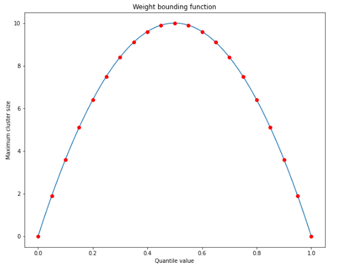
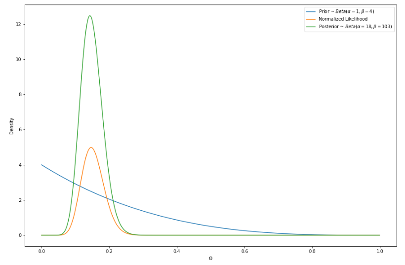
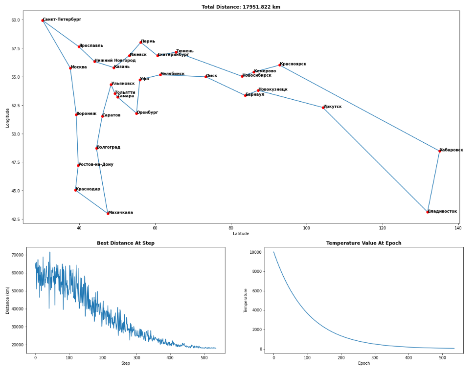

# STDSR-homeworks

This repository contains homeworks of the **S**tatistical **T**echniques for **D**ata **S**cience and **R**obotics S2022 course from the Innopois University

## Homework 1

Implementation of T-digest data structure for fast approximate quantile calculation methods

## Homework 2

Bayesian inference. The tasks are located in **hw2_tasks.pdf** file

## Homework 3

Simulated annealing for the traveling salesman problem approximate solution

